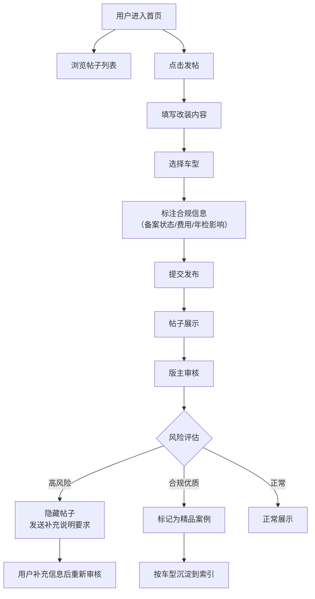

## 1. 产品概述
车友改装备案论坛是面向汽车改装爱好者的垂直社区平台，致力于构建合法、规范的改装交流环境。用户可分享各类改装经验并标注合规信息，版主把控内容风险，精品案例按车型沉淀形成知识库。

- 解决改装信息分散、合规性不透明的痛点，降低用户违法改装风险
- 目标用户：汽车改装爱好者、计划改装的车主、汽车行业从业者

## 2. 核心 Features

### 2.1 用户角色

| 角色 | 注册方式 | 核心权限 |
|------|----------|----------|
| 普通用户 | 手机号/昵称注册 | 发布帖子、浏览内容、评论互动、收藏案例 |
| 版主 | 管理员授予 | 所有用户权限 + 隐藏高风险帖子、要求补充说明、标记精品案例 |

### 2.2 Feature 模块
1. **首页**：帖子列表、分类筛选、搜索功能、快捷发帖入口
2. **发帖页**：改装分类选择（轮毂/灯光/避震/内饰）、车型选择、备案信息、费用、年检影响填写
3. **帖子详情页**：完整内容展示、评论区、版主操作入口
4. **车型索引页**：按品牌/车型分类的精品案例聚合
5. **个人中心**：我的帖子、我的收藏、身份切换（普通用户/版主）

### 2.3 Page 详情

| 页面名称 | 模块名称 | 功能描述 |
|----------|----------|----------|
| 首页 | 顶部导航 | Logo、搜索框、身份切换、发帖按钮 |
| 首页 | 分类筛选 | 改装类型Tab（全部/轮毂/灯光/避震/内饰）、备案状态筛选 |
| 首页 | 帖子列表 | 卡片式展示，显示缩略图、车型、改装类型、备案状态、费用 |
| 首页 | 快捷入口 | 车型索引、热门车型、发帖引导 |
| 发帖页 | 表单区域 | 改装分类、车型选择、标题、内容、图片上传 |
| 发帖页 | 合规信息 | 是否备案（单选）、费用（数字输入）、年检影响（下拉选择） |
| 帖子详情页 | 内容展示 | 图片轮播、正文、合规信息标签区 |
| 帖子详情页 | 版主操作 | 隐藏帖子按钮、要求补充说明按钮、标记精品按钮 |
| 帖子详情页 | 评论区 | 评论列表、发表评论 |
| 车型索引页 | 品牌车系列表 | 按品牌首字母排序，展示精品案例数量 |
| 车型索引页 | 车型详情 | 该车型下所有精品改装案例列表 |
| 个人中心 | 身份卡片 | 用户信息、角色切换（演示用） |
| 个人中心 | 我的发布 | 已发布帖子列表（含被隐藏状态） |

## 3. 核心流程

用户发布改装帖子时必须填写车型、备案状态、费用和年检影响四项合规信息；版主可对高风险内容进行隐藏并要求补充说明；通过审核的精品案例会自动归类到对应车型的索引库中。

## 4. 界面设计

### 4.1 设计风格
- 主色调：炭黑色 `#121212` + 改装金属蓝 `#2563EB` + 警示橙 `#F97316`
- 按钮风格：圆角 8px，主按钮渐变蓝，版主操作按钮使用警示色
- 字体：标题使用 `Orbitron`（科技感改装风格），正文使用 `Noto Sans SC`
- 布局风格：卡片式网格布局，带有金属质感边框和微妙光泽效果
- 图标风格：线性图标，配合改装元素（轮毂、灯光、避震器、座椅）

### 4.2 页面设计概览

| 页面名称 | 模块名称 | UI 元素 |
|----------|----------|----------|
| 首页 | 导航栏 | 深色背景，发光Logo，搜索框带车型联想，发帖按钮悬浮动画 |
| 首页 | 帖子卡片 | 图片圆角8px，信息标签（备案状态用颜色区分），悬浮放大效果 |
| 首页 | 分类Tab | 下划线动画，选中状态高亮发光 |
| 发帖页 | 表单 | 分组卡片，必填项红星标注，图片拖拽上传区域 |
| 发帖页 | 合规信息区 | 特殊背景色突出显示，四个字段并排展示 |
| 帖子详情 | 合规标签 | 醒目的信息块，备案状态绿/橙/红三色标识 |
| 帖子详情 | 版主操作 | 固定在页面右侧，悬停显示说明 |
| 车型索引 | 品牌列表 | 字母索引导航，卡片带有车型Logo位置，悬停上浮 |

### 4.3 响应式
- 桌面端优先，采用 1200px 最大宽度居中布局
- 平板端：卡片从 3 列变为 2 列
- 移动端：单列布局，底部导航栏替代顶部菜单
- 触摸优化：增大点击区域到 48x48px，卡片点击反馈

### 4.4 动效设计
- 页面加载：卡片依次淡入上浮（stagger 动画）
- 发帖成功：绿色对勾缩放动画
- 版主隐藏：红色遮罩渐入，提示信息滑入
- 图片轮播：平滑过渡，指示器缩放
- 滚动监听：导航栏背景模糊效果随滚动变化
