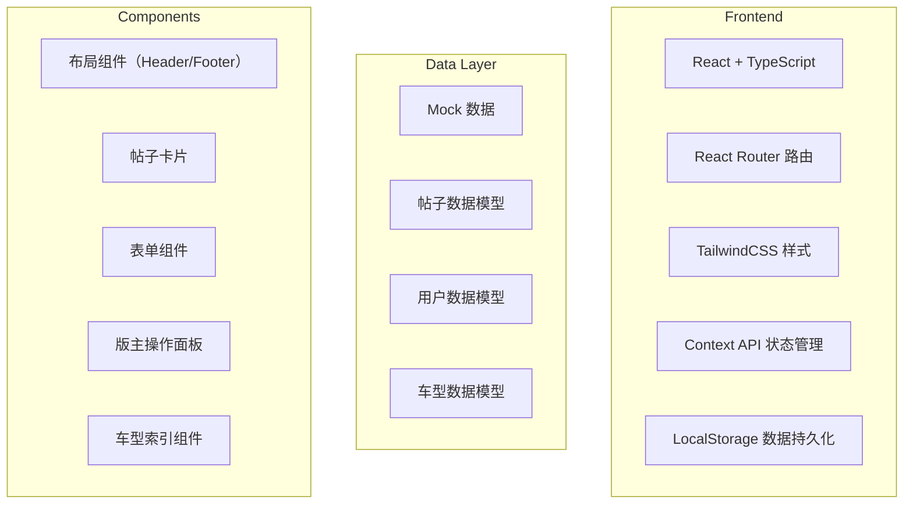
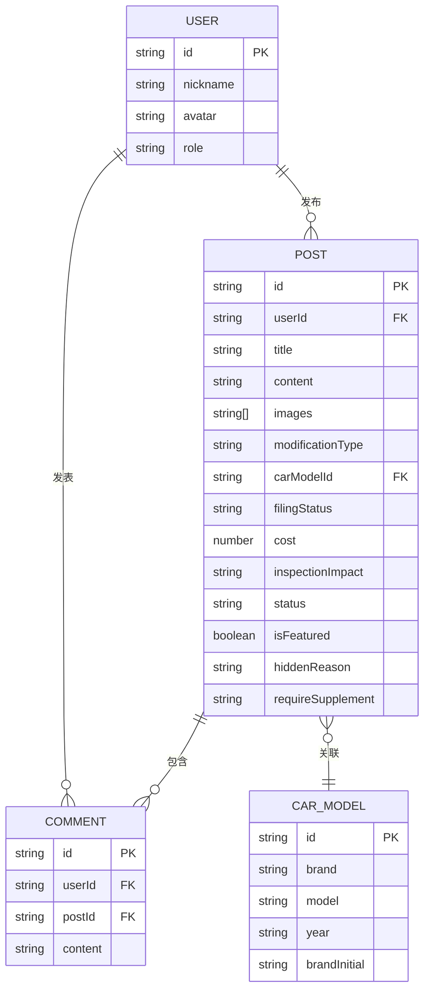

## 1. 架构设计



## 2. 技术选型说明

- **前端框架**：React@18 + TypeScript + Vite
- **初始化工具**：vite-init (npm create vite@latest)
- **样式方案**：TailwindCSS@3 + PostCSS
- **路由管理**：React Router DOM@6
- **状态管理**：React Context API（全局用户状态、帖子状态）
- **数据持久化**：LocalStorage（模拟后端存储）
- **图标库**：Lucide React
- **后端**：无（纯前端 Mock 数据 + LocalStorage）
- **数据库**：无（使用 JSON 格式数据存储于 LocalStorage）

## 3. 路由定义

| 路由 | 页面 | 说明 |
|------|------|------|
| `/` | 首页 | 帖子列表、分类筛选、搜索 |
| `/post/:id` | 帖子详情页 | 展示完整内容、评论、版主操作 |
| `/create` | 发帖页 | 发布新的改装分享 |
| `/index` | 车型索引页 | 按品牌车型聚合精品案例 |
| `/index/:brand/:model` | 车型详情页 | 特定车型的所有精品案例 |
| `/profile` | 个人中心 | 我的帖子、身份切换 |

## 4. 数据类型定义

```typescript
// 改装类型
type ModificationType = 'wheel' | 'light' | 'suspension' | 'interior';

// 备案状态
type FilingStatus = 'filed' | 'pending' | 'not_filed';

// 年检影响
type InspectionImpact = 'no_impact' | 'need_restore' | 'may_fail';

// 帖子状态
type PostStatus = 'published' | 'hidden' | 'featured';

// 用户角色
type UserRole = 'user' | 'moderator';

// 用户信息
interface User {
  id: string;
  nickname: string;
  avatar: string;
  role: UserRole;
  createdAt: string;
}

// 车型信息
interface CarModel {
  id: string;
  brand: string;
  model: string;
  year: string;
  brandInitial: string;
}

// 帖子信息
interface Post {
  id: string;
  userId: string;
  user: User;
  title: string;
  content: string;
  images: string[];
  modificationType: ModificationType;
  carModel: CarModel;
  filingStatus: FilingStatus;
  cost: number;
  inspectionImpact: InspectionImpact;
  status: PostStatus;
  isFeatured: boolean;
  hiddenReason?: string;
  requireSupplement?: string;
  comments: Comment[];
  createdAt: string;
  updatedAt: string;
}

// 评论
interface Comment {
  id: string;
  userId: string;
  user: User;
  content: string;
  createdAt: string;
}
```

## 5. 数据模型 ER 图



## 6. 项目目录结构

```
src/
├── assets/             # 静态资源
├── components/         # 通用组件
│   ├── Layout/        # 布局组件
│   ├── PostCard/      # 帖子卡片
│   ├── PostForm/      # 发帖表单
│   ├── CommentSection/ # 评论区
│   ├── ModeratorPanel/ # 版主操作面板
│   └── CarIndex/      # 车型索引
├── context/           # 状态管理
│   ├── UserContext.tsx
│   └── PostContext.tsx
├── data/              # Mock 数据
│   ├── mockPosts.ts
│   ├── mockUsers.ts
│   └── mockCars.ts
├── pages/             # 页面组件
│   ├── Home.tsx
│   ├── PostDetail.tsx
│   ├── CreatePost.tsx
│   ├── CarIndex.tsx
│   ├── CarModelDetail.tsx
│   └── Profile.tsx
├── types/             # TypeScript 类型
│   └── index.ts
├── utils/             # 工具函数
│   ├── storage.ts     # LocalStorage 封装
│   └── helpers.ts
├── App.tsx
├── main.tsx
└── index.css
```

## 7. 核心功能实现说明

### 7.1 发帖功能
- 表单验证：车型、备案状态、费用、年检影响为必填项
- 图片上传：支持本地图片预览（使用 FileReader API）
- 数据持久化：发帖成功后写入 LocalStorage

### 7.2 版主功能
- 角色权限判断：通过 UserContext 中的 role 字段控制操作按钮显示
- 隐藏帖子：修改 post.status 为 'hidden'，记录 hiddenReason
- 要求补充说明：设置 post.requireSupplement 字段，发送系统通知
- 标记精品：设置 post.isFeatured = true，自动关联车型索引

### 7.3 车型索引
- 按品牌首字母分组展示
- 统计每个车型的精品案例数量
- 点击车型展示该车型下所有 isFeatured = true 的帖子

### 7.4 本地存储封装
- 使用 `localStorage` 模拟后端
- 封装 `getItem` / `setItem` 方法，自动处理 JSON 序列化
- 初始化时检测是否有数据，无数据则加载 Mock 数据
